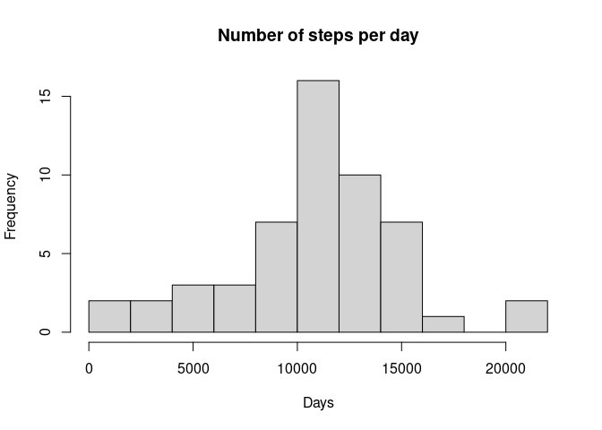
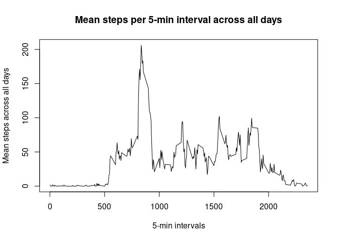
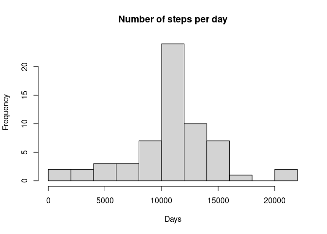
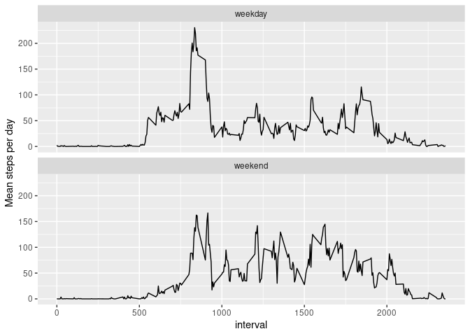

## Loading and preprocessing the data

- The data will be read directly from your working directory and stored in the variable called "activity".


```r
activity = read.csv("activity.csv")
```

- For the sake of consistency, and as this may prove useful later, the dates stored in the date column which is stored as a character should also be changed into date objects


```r
activity$date = as.Date(activity$date)
```

## What is mean total number of steps taken per day?

- As we are interested in the total number of steps per day. First, a new variable "stepsPerDay" was created, and in it I stored the sum of the steps taken each day via a "tapply".


```r
stepsPerDay = with(activity, tapply(steps, date, sum))
```

- A histogram was then created using this new variable with the number of breaks set to 10, and it seems to suggest that the highest frequency is around 11k to 12k steps per day.


```r
hist(stepsPerDay, main = "Number of steps per day", xlab = "Days", breaks = 10)
```

<!-- -->

- The summary function was then used on the "stepsPerDay" variable, and we can see that both the median and mean are equal to 10765 and 10766, which corresponds to the data seen in the histogram.


```r
summary(stepsPerDay)
```

```
##    Min. 1st Qu.  Median    Mean 3rd Qu.    Max.    NA's 
##      41    8841   10765   10766   13294   21194       8
```

## What is the average daily activity pattern?

- For this part, I found the "dply" library to be very useful.
- First step after loading the library was to omit all NAs from the data set, as since we are going to be taking the means of the steps for each 5-min interval across all the days, any NA value, would result in the whole mean being returned as NA, and since some days had nothing but NA values, that means that all our results would be NA otherwise.


```r
library(dplyr)
```

```
## 
## Attaching package: 'dplyr'
```

```
## The following objects are masked from 'package:stats':
## 
##     filter, lag
```

```
## The following objects are masked from 'package:base':
## 
##     intersect, setdiff, setequal, union
```

```r
noNaActiv = na.omit(activity)
```

- I then used "dplyr" to group the new NA free data set "noNaActiv" by interval so that when I take the means of the steps, they will be grouped by their respective 5-min intervals.


```r
grouped = group_by(noNaActiv, interval)
```

- Next, I summarized the grouped data set, conveniently named "grouped" into a new set called "stepsmean", and stored the means of the steps in the variable "meansteps".


```r
stepsmean = summarize(grouped, meansteps=mean(steps))
```

- Finally, I plotted the time series, and from it, we can see that the highest average number of steps, seem to belong to approximately the 850-min interval.


```r
plot(stepsmean$meansteps~stepsmean$interval, type = "l", xlab = "5-min intervals", ylab = "Mean steps across all days", main="Mean steps per 5-min interval across all days")
```

<!-- -->

## Imputing missing values

- Below is the sum of NA values in the dataset.


```r
sum(is.na(activity))
```

```
## [1] 2304
```

- My approach to the imputation question, was to replace the NA value of each interval, with the mean of the interval, previously calculated and stored in "stepsmean". This was done using the following function :


```r
NAreplacer = function(x,y) {
        x = x
        y = y
        inter = y$interval
    for (i in inter){
            x[is.na(x$steps)& x$interval == i,]$steps = y[y$interval == i,]$meansteps
    }
        return(x)
}
imputedAct = NAreplacer(activity, stepsmean)
```

- With the new imputed set "imputedAct", I created a new array of the sums of steps per day.


```r
stepsPerDayImputed = with(imputedAct, tapply(steps, date, sum))
```

- Then created a new histogram for the new array.


```r
hist(stepsPerDayImputed, main = "Number of steps per day", xlab = "Days", breaks = 10)
```

<!-- -->

- And finally, recalculated the summary for the new array.


```r
summary(stepsPerDayImputed)
```

```
##    Min. 1st Qu.  Median    Mean 3rd Qu.    Max. 
##      41    9819   10766   10766   12811   21194
```

- The only difference I was able to discern from the imputation step, is that the median increased from 10765 to 10766, which is a negligible change, and more importantly, as there are more data points to work with, the bars of the histogram seem to have shrunk a bit, as the frequency increased from a total of 15, to 20, but the distribution itself is the exact same.

## Are there differences in activity patterns between weekdays and weekends?

- First, lets add the weekdays to a variable called weekday.


```r
weekday = c('Monday', 'Tuesday', 'Wednesday', 'Thursday', 'Friday')
```

- Next, we can use the a logical expression to decide if each day in weekdays is in the "weekday" variable or not, and based on the answer, we separate the results over the levels TRUE and FALSE, which will be labeled "weekday", and "weekend".


```r
days = factor(weekdays(imputedAct$date)%in%weekday, levels = c(TRUE, FALSE), labels = c("weekday", "weekend"))
```

- Now we add the new factor variable to the "imputedAct" dataset.


```r
imputedAct$days = days
```

- Group the dataset by days and interval, then summarize by the mean of steps.


```r
weekDE = group_by(imputedAct, days, interval)

meandays = summarize(weekDE, meandays = mean(steps))
```

```
## `summarise()` has grouped output by 'days'. You can override using the
## `.groups` argument.
```

- And create the time series plot using "ggplot2".


```r
library(ggplot2)

ggplot(meandays, aes(x=interval, y = meandays)) + geom_line() + facet_wrap(.~days, ncol = 1) + ylab(label = "Mean steps per day")
```

<!-- -->

- From the plots, we can see that there is variation between the activities between weekdays and weekends, as the subject seems to have a spike in activity as we have seen before at the 850-min interval, then the activity data seems to decrease, but in weekends, there is still a similar, although smaller spike at first, but then the data seems to spike a lot more at different intervals.
